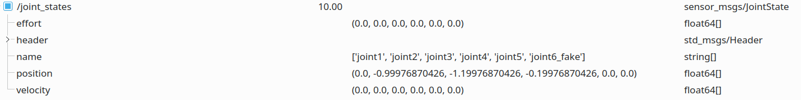
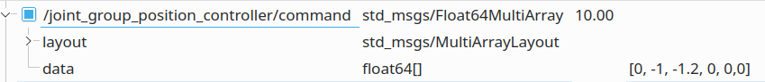

# yj10_driver

YJ10 机械臂的驱动，负责与实体机械臂通信。

## 主要文件

### launch 文件

- yj10_connect.launch

    作用：连接实体机械臂，启动 ROS Controller ，启动夹持器控制相关的服务

- yj10_connect_rviz.launch

    作用：启动yj10_connect.launch 和 rviz

- rqt_monitor.launch

    作用：打开 rqt，方便监测和发布 topic 和 service

### 配置文件

这个包中主要有以下配置文件：

- config/yj10_driver.yaml

    在该文件中配置串口设备、是否开启 fake_connect，指定初始位姿。

    fake_connect 打开后，程序将不会真正地连接机械臂，它会向 ROS 返回假数据，方便无机械臂调试。

- config/yj10_controllers.yaml

    在该文件中配置与机械臂的通信频率，建议不超过 10 Hz

    也可以在该文件中增加 ros controller。但只支持 position_controllers

## 使用说明

### 连接机械臂

```bash
roslaunch yj10_driver yj10_connect.launch
# 或
roslaunch yj10_driver yj10_connect_rviz.launch
```

### 控制机械臂

#### 前置说明

##### 在成功启动后，会发布如下 topic

```text
# 夹持器相关
/clamp/fdb # 夹持器反馈（如果使用 fake_connect，则不会有消息）
/clamp/set_closing_current # 设置夹持器闭合电流

/joint_states # 机械臂关节角度信息

# 当 joint_group_position_controller 为 running 时，向这个 topic 发布关节角度可以控制机械臂
/joint_group_position_controller/command

# 轨迹控制器，主要由 moveit 使用
/position_trajectory_controller/command
/position_trajectory_controller/follow_joint_trajectory/cancel
/position_trajectory_controller/follow_joint_trajectory/feedback
/position_trajectory_controller/follow_joint_trajectory/goal
/position_trajectory_controller/follow_joint_trajectory/result
/position_trajectory_controller/follow_joint_trajectory/status
/position_trajectory_controller/state

/tf # 坐标变换信息，可以使用 tf2_ros 包监听并计算坐标变换
/tf_static
```

> 关于这些 topic 的更多信息，请搜索 ros control

##### 在成功启动后，会发布如下 service

```text
# 夹持器相关
/clamp/close
/clamp/open
/clamp/stop

# 来自 ros control 和 controller manager
/controller_manager/list_controller_types
/controller_manager/list_controllers
/controller_manager/load_controller
/controller_manager/reload_controller_libraries
/controller_manager/switch_controller
/controller_manager/unload_controller
/position_trajectory_controller/query_state
/robot_state_publisher/get_loggers
/robot_state_publisher/set_logger_level
/yj10_hardware_interface/get_loggers
/yj10_hardware_interface/set_logger_level
```

### 关节角度获取和控制

> 可以使用 rqt 查看和发布消息，记得先 source，否则自定义的消息类型无法解析

- 关节当前角度信息发布在`/joint_states`下

    其中 `position` 是一个数组，里面是各个关节的角度（弧度制），顺序和 `name` 中的名称相同

    *注意：关节顺序由 `name`中的顺序决定，可能不是 1~6*

    > 注意：机械臂并不能反馈关节实际角度，所以这里的信息是假信息。

    内容具体如下：

    

- 向 `/joint_group_position_controller/command` 发布消息可以控制机械臂关节角度

    *注意：关节顺序由 [config/yj10_controllers.yaml](config/yj10_controllers.yaml)中 `joint_group_position_controller:` 下 `joints:` 的顺序决定，可能与 `/joint_states` 中的顺序不同*

    消息长这样：

    

### 夹持器相关

#### 夹持器反馈

`/clamp/fdb` 下发布的是夹持器的反馈信号

（如果使用 fake_connect，则不会有消息）

消息定义请看 [msg/Clamp.msg](msg/Clamp.msg)

其中 state 数字定义如下：

```c++
enum class ClamperState
{
    Stop = 0,
    Close = 1,
    Open = 2,
    Middle = 3,
    Error = 4
};
```

#### 设置闭合电流

设置方法：向 `/clamp/set_closing_current` 发布电流值（安培）

（请不要频繁发布）

电流最大 0.8 A，小于 0.1 A 时夹持器可能不能成功闭合

控制这个电流大小理论上可以控制夹持力度

#### 控制夹持器

调用以下 service 以控制夹持器：

```text
/clamp/close
/clamp/open
/clamp/stop
```

尽量不要在关节运动时调用读写夹持器的服务

夹持器在闭合状态下不要再次调用闭合命令，在完全张开状态下不要再次调用张开命令
